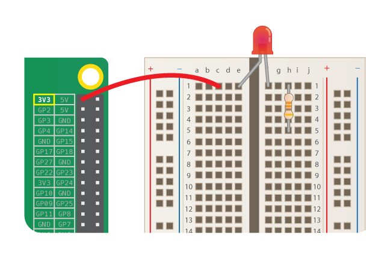

Per encendre un LED, has de crear un circuit amb aquests components:

| Placa de proves                           | Cable pont mascle-femella                    | LED                    | Resistència                         | Component que proporciona energia      |
| ----------------------------------------- | -------------------------------------------- | ---------------------- | ----------------------------------- | -------------------------------------- |
|  |  |  |  |  |

Mira el teu LED. Hauries de veure que un terminal és més llarg que l'altre. El terminal més llarg és el **positiu**, també anomenat **ànode**. Sempre l’has de connectar al costat positiu d’un circuit. El terminal més curt és el **negatiu**, també anomenat **càtode**. Necessita estar connectat al costat negatiu del circuit. Una manera de recordar-ho és imaginar el terminal llarg com una cosa afegida i el curt com haver-ne tret alguna cosa.

Trobaràs que hi ha LEDs que tenen els terminals de la mateixa llargada. En aquest cas, el terminal positiu es troba en la vora de plàstic rodona del LED. En el terminal negatiu, la vora de plàstic estarà aplanada, com a la imatge de sota.

+ Introdueix el terminal positiu del LED a la fila 1 de la placa de proves, a prop del costat esquerre de l'esquerda. Col·loca el terminal negatiu a la fila 1 de l’altre costat de l'esquerda de la placa.

+ Ara busca la teva resistència. Una resistència és un component no polaritzat, per la qual cosa no importa de quina manera el posis a la placa. Col·loca un terminal a la mateixa fila en què es troba el terminal negatiu del LED, així quedaran connectats. Introdueix l'altre terminal de la resistència a qualsevol altra fila lliure del costat dret de l'esquerda de la placa.

+ Ara agafa un cable pont mascle-femella i posa l’extrem mascle a la mateixa fila que el LED, al costat esquerre de l'esquerda prop del terminal positiu del LED. Introdueix l’extrem femella al pin etiquetat **3V3**.

El teu circuit hauria d’assemblar-se a aquest:

Ara, connecta els teus components al pin de terra (**GND**) GPIO:

+ Assegura't que la teva Raspberry Pi estigui engegada. Agafa un altre cable pont mascle-femella i col·loca l’extrem mascle a la mateixa fila que hi ha el segon terminal de la resistència, al mateix costat de l'esquerda. Introdueix l’extrem femella al teu pin **GND**. El teu LED hauria d’il·luminar-se!

Si el teu LED no s’il·lumina, prova el següent: 1) Comprova que la teva Raspberry Pi estigui engegada 2) Comprova que tots els teus components estan introduïts fermament a la placa de proves 3) Comprova que el teu LED sigui a la posició correcta 4) Assegura't que els terminals dels components es troben a la part dreta de l'esquerda de la placa. 5) Prova un altre LED
