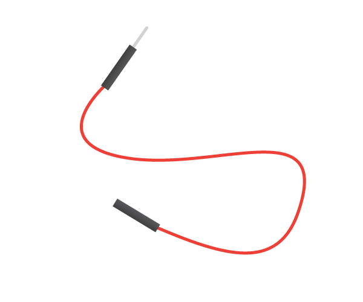
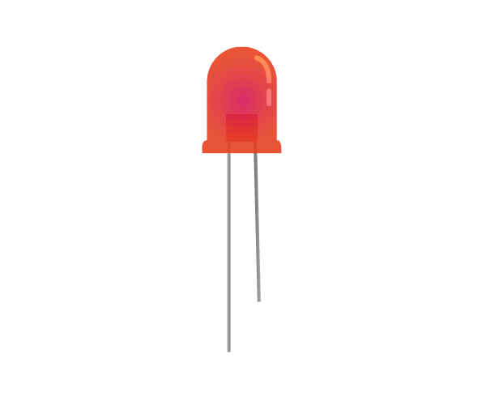

Um eine LED leuchten zu lassen, musst du eine Schaltung aus folgenden Komponenten erstellen:

| Steckbrett                           | Überbrückungsdrähte männlich - weiblich | LED                    | Widerstand                         | Stromquelle                            |
| ------------------------------------ | --------------------------------------- | ---------------------- | ---------------------------------- | -------------------------------------- |
|  |       |  |  |  |

Schau dir deine LED an. Du solltest sehen, dass ein Bein länger ist als das andere. Das lange Bein ist das **positive** Bein und wird auch ** Anode** genannt. Es sollte immer an die positive Seite eines Stromkreises angeschlossen werden. Das kurze Bein ist das ** negative ** Bein, genannt ** Kathode **. Es muss mit der negativen Seite verbunden werden. Eine Möglichkeit, sich daran zu erinnern, besteht darin, sich vorzustellen, dass dem langen Bein etwas hinzugefügt wurde und dem kurzen Bein etwas weggenommen wurde.

Du wirst feststellen, dass es LEDs mit gleich langen Beinen gibt. In diesem Fall ist das positive Bein das Bein, an dem die Kunststoffkante der LED rund ist. Wo sich das negative Bein befindet, wird der Rand abgeflacht, wie im Bild unten.

+ Push the positive leg of the LED into row 1 of your breadboard, close to the left side of the ravine. Place the negative leg into row 1 on the other side of the ravine.

+ Now find your resistor. A resistor is a non-polarised component, so it doesn’t matter which way around you put it into the breadboard. Push one leg into the same row that the negative LED leg is in, so it connects to the LED. Push the other resistor leg into any other free row on the right side of the ravine.

+ Now take a male-to-female jumper wire and push the male end into the same row as the LED, on the left side of the ravine near the LED's positive leg. Push the female end onto the **3V3** GPIO pin.

Your circuit should look a little like this:

Now, connect your components to the ground (**GND**) GPIO pin:

+ Make sure that your Raspberry Pi is powered on. Take another male-to-female jumper wire and push the male end into the same row as the resistor’s second leg, on the same side of the ravine. Then push the female end onto your **GND** pin. Your LED should light up!

If your LED doesn’t light, try the following: 1) Check your Raspberry Pi is on 2) Check all your components are pushed firmly into the breadboard 3) Check your LED is the right way around 4) Make sure the legs of your components are on the right side of the ravine 5) Try another LED
