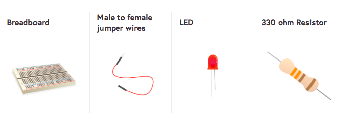

To light an LED, you need to build a circuit. You're going to need:

Have a look at your LED. You should see that one leg is longer than the other. The long leg (<i>anode</i>) should always be connected to the positive side of a circuit. One way to remember this is to imagine the longer leg as having had something added and the shorter leg has had something taken away. Sometimes LEDs have legs the same length, in which case the <i>anode</i> is the side where the plastic rim of the LED is round. The negative side (<i>cathode</i>) will be slightly flattened.

+ Push the long leg of the LED into row one, close to the ravine. Place the shorter leg into row one on the other side of the ravine.

+ Now find your resistor. A resistor is a non-polarised component, so it doesn’t matter which way around it goes. Push one leg into the same row as the shorter of the LED legs, so it connects to the LED, and the other leg into any other free row.

+ Now take a female-to-male jumper wire and push the male end into the same row as the resistor’s second leg. Push the female end into the ***3v3 GPIO***

Your circuit should look a little like this:

+ Now, connect your components to the ground pin. Make sure that your Raspberry Pi is powered on and then take the female end of another jumper wire and plug it into your ground pin (***GND GPIO***).

If your LED doesn’t light, then try the following things:
1) Check your Raspberry Pi is on.
2) Check all your components are firmly in the breadboard.
3) Check your LED is the right way around.
4) Try another LED.
