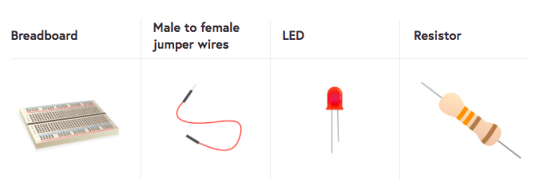

To light an LED, you need to build a circuit. You're going to need:

This image below shows a very simple circuit. There are four components, all connected up with wires.

1) The cell provides energy to the circuit in the form of electricity. A cell has a positive and a negative side. Electric current flows from the positive side of the cell to the negative side of the cell.

2) The Light Emitting Diode (LED) is a type of Output Component. When current flows through the LED, it emits light. Different LEDs can produce many different colours of light, and some can even produce multiple colours.

3) The resistor helps protect the LED. Resistors use up some of the energy from the cell, and therefore reduce the amount of energy that reaches the LED. Without the resistor, the LED could burn out, in much the same way as a fuse does in many of your household appliances.

4) The switch acts as a break in the circuit. When the switch is open then no current can flow through the LED or the resistor. When the switch is closed, the circuit is complete and current can flow, causing the LED to switch on.

Have a look at your LED. You should see that one leg is longer than the other. The long leg (<i>anode</i>) should always be connected to the positive side of a circuit. One way to remember this is to imagine the longer leg as having had something added and the shorter leg has had something taken away. Sometimes LEDs have legs the same length, in which case the <i>anode</i> is the side where the plastic rim of the LED is round. The negative side (<i>cathode</i>) will be slightly flattened.

+ Push the long leg of the LED into row one, close to the ravine. Place the shorter leg into row one on the other side of the ravine.

+ Now find your resistor. A resistor is a non-polarised component, so it doesn’t matter which way around it goes. Push one leg into the same row as the shorter of the LED legs, so it connects to the LED, and the other leg into any other free row.

+ Now take another female-to-male jumper wire and push the male end into the same row as the resistor’s second leg.

Your circuit should look a little like this:

+ Now, connect your components to the ground pin. Make sure that your Raspberry Pi is powered on and then take the female end of the jumper wire and plug it into your ground pin.

If your LED doesn’t light, then try the following things:
1) Check your Raspberry Pi is on.
2) Check all your components are firmly in the breadboard.
3) Check your LED is the right way around.
4) Try another LED.
