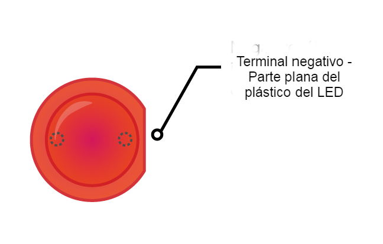

Para encender un LED, necesitas construir un circuito con estos componentes:

| Placa de pruebas                           | Cable puente macho a hembra      | LED                    | Resistencia                         | Fuente de alimentación                 |
| ------------------------------------------ | -------------------------------- | ---------------------- | ----------------------------------- | -------------------------------------- |
|  |  |  |  |  |

Echa un vistazo a tu LED. Deberías ver que una patilla es más larga que la otra. La patilla más larga es el terminal **positivo**, también llamado el **ánodo**. Siempre debe estar conectado al lado positivo de un circuito. La patilla más corta es el terminal **negativo**, también llamado el **cátodo**. Necesita estar conectada al lado negativo. Una forma de recordar esto es imaginar que la patilla larga tiene algo añadido y a la patilla corta se le quitó algo.

Encontrarás que hay LEDs que tienen patillas de la misma longitud. In that case, the positive leg is the leg where the plastic edge of the LED is round. Where the negative leg is, the edge will be flattened, like in the image below.

+ Push the positive leg of the LED into row 1 of your breadboard, close to the left side of the ravine. Place the negative leg into row 1 on the other side of the ravine.

+ Now find your resistor. A resistor is a non-polarised component, so it doesn’t matter which way around you put it into the breadboard. Push one leg into the same row that the negative LED leg is in, so it connects to the LED. Push the other resistor leg into any other free row on the right side of the ravine.

+ Now take a male-to-female jumper wire and push the male end into the same row as the LED, on the left side of the ravine near the LED's positive leg. Push the female end onto the **3V3** GPIO pin.

Your circuit should look a little like this:

Now, connect your components to the ground (**GND**) GPIO pin:

+ Make sure that your Raspberry Pi is powered on. Take another male-to-female jumper wire and push the male end into the same row as the resistor’s second leg, on the same side of the ravine. Then push the female end onto your **GND** pin. Your LED should light up!

If your LED doesn’t light, try the following: 1) Check your Raspberry Pi is on 2) Check all your components are pushed firmly into the breadboard 3) Check your LED is the right way around 4) Make sure the legs of your components are on the right side of the ravine 5) Try another LED
