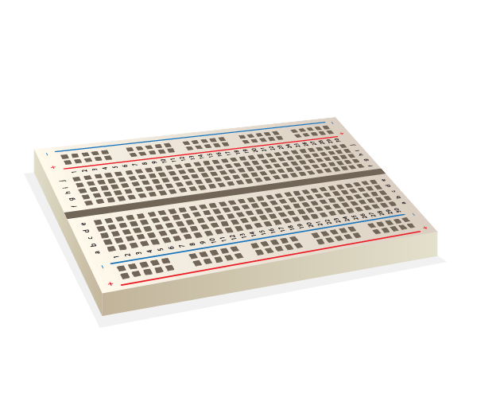

Para encender un LED, necesitas construir un circuito con estos componentes:

| Placa de pruebas                           | Cable puente macho a hembra                         | LED                    | Resistencia                         | Componente de alimentación             |
| ------------------------------------------ | --------------------------------------------------- | ---------------------- | ----------------------------------- | -------------------------------------- |
|  |  |  |  |  |

Echa un vistazo a tu LED. Deberías ver que un terminal es más largo que el otro. El tramo largo es el terminal **positivo**, también llamado el **ánodo**. Siempre debe estar conectado al lado positivo de un circuito. El tramo corto es el terminal **negativo**, también llamado el **cátodo**. Necesita estar conectado al lado negativo. Una forma de recordar esto es imaginar que el terminal largo tiene algo añadido y que al terminal corto se le quitó algo.

Encontrarás que hay LEDs que tienen terminales de la misma longitud. En ese caso, el terminal positivo es donde el borde de plástico del LED es redondo. Donde está el terminal negativo, el borde estará plano, como en la imagen siguiente.

+ Empuja el terminal positivo del LED en la fila 1 de tu placa de pruebas en la parte izquierda de la hendidura cerca de ella. Coloca el terminal negativo en la fila 1 al otro lado de la hendidura del tablero.

+ Ahora busca tu resistencia. Una resistencia es un componente no polarizado, por lo que no importa en qué dirección lo coloques en la tabla de nodos. Empuja un terminal en la misma fila en la que se encuentra el terminal negativo del LED, para que se conecte al él. Empuja el otro terminal de la resistencia en cualquier otra fila libre en el lado derecho a la hendidura de la placa.

+ Ahora toma un cable de puente de macho a hembra y empuja el extremo macho en la misma fila que el LED, en el lado izquierdo de la hendidura de la placa, cerca de la pata positiva del LED. Empuja el extremo hembra sobre el pin GPIO **3V3**.

Tu circuito debería verse un poco así:

Ahora, conecta tus componentes al pin GPIO de tierra (**GND**):

+ Asegúrate de que tu Raspberry Pi esté encendida. Toma otro cable de puente de macho a hembra y empuja el extremo macho en la misma fila que el segundo terminal de la resistencia, en el mismo lado de la hendidura de la placa. Ahora empuja el extremo hembra sobre el pin **GND**. ¡Tu LED debería encenderse!

Si tu LED no se enciende, intenta lo siguiente: 1) Verifica que tu Raspberry Pi esté encendida 2) Verifica que todos tus componentes estén firmemente insertados en la tabla de nodos 3) Verifica que tu LED esté en la posición correcta 4) Verifica que los terminales de tus componentes estén en el lado derecho de la hendidura del tablero 5) Prueba con otro LED
