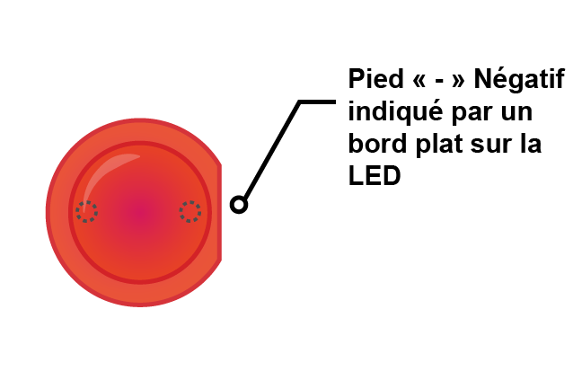

Pour allumer une LED, tu dois construire un circuit à partir de ces composants :

| Platine d'expérimentation                           | Fils de connexion mâle à femelle | LED                    | Résistance                         | Composant de puissance                 |
| --------------------------------------------------- | -------------------------------- | ---------------------- | ---------------------------------- | -------------------------------------- |
|  |  |  |  |  |

Jette un œil à ta LED. Tu devrais voir qu'un pied est plus long que l'autre. Le long pied est le pied **positif**, et également appelé **anode**. Il doit toujours être connecté au côté positif d'un circuit. Le pied court est le pied **négatif**, appelé **cathode**. Il doit être connecté au côté négatif. Une façon de s'en souvenir est d'imaginer le long pied comme ayant eu quelque chose d'ajouté et le pied court comme ayant eu quelque chose d'enlevé.

Tu constateras qu'il y a des LED qui ont des pieds de la même longueur. Dans ce cas, le pied positif est le pied où le bord en plastique de la LED est rond. Où se trouve le pied négatif, le bord sera aplati, comme dans l'image ci-dessous.

+ Pousse le pied positif de la LED dans la rangée 1 de ta platine d'expérimentation, près du côté gauche du ravin. Place le pied négatif dans la rangée 1 de l'autre côté du ravin.

+ Trouve maintenant ta résistance. Une résistance est un composant non polarisé, donc peu importe dans quel sens tu la mets dans la platine d'expérimentation. Pousse un pied dans la même rangée que le pied négatif de la LED , afin qu'il se connecte à la LED. Pousse l'autre pied de la résistance dans n'importe quelle autre rangée libre sur le côté droit du ravin.

+ Maintenant, prends un fil de connexion mâle à femelle et pousse l'extrémité mâle dans la même rangée que la LED, sur le côté gauche du ravin près du pied positif de la LED. Pousse l'extrémité femelle sur la broche GPIO **3V3**.

Ton circuit devrait ressembler un peu à ceci :

Maintenant, connecte tes composants à la broche masse GPIO (**GND** ) :

+ Assure-toi que ton Raspberry Pi est sous tension. Prends un autre fil de connexion mâle à femelle et pousse l'extrémité mâle dans la même rangée que le deuxième pied de la résistance, du même côté du ravin. Pousse ensuite l'extrémité femelle sur ta broche ** GND **. Ta LED devrait s'allumer !

Si ta LED ne s'allume pas, essaie ce qui suit : 1) Vérifie que ton Raspberry Pi est allumé 2) Vérifie que tous tes composants sont fermement enfoncés dans la platine d'expérimentation 3) Vérifie que ta LED est dans le bon sens 4) Assure-toi que les pieds de tes composants sont du côté droit du ravin 5) Essaie une autre LED
