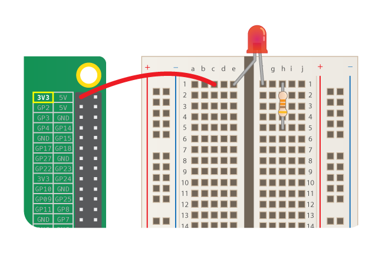

एक LED को जलाने के लिए, आपको इन पुर्ज़ो में से एक सर्किट बनाने की आवश्यकता है:

| ब्रेड बोर्ड (breadboard)             | मेल-टू-फीमेल जंपर तार (Male-to-female jumper wires) | LED                    | रेसिस्टर                         | पावर घटक                               |
| ------------------------------------ | --------------------------------------------------- | ---------------------- | -------------------------------- | -------------------------------------- |
|  |                     |  |  |  |

अपने LED पर नजर डालें। आपको देखना चाहिए कि एक पैर दूसरे की तुलना में लंबा है। लम्बा पैर **पॉजिटिव** पैर हैं, और इसे **एनोड** भी कहा जाता है । यह हमेशा एक सर्किट के पॉजिटिव बाजू से हि जुड़ा होना चाहिए। छोटा पैर **नेगेटिव** पैर हैं, और उसे **कैथोड** कहा जाता हैं। इसे नेगेटिव बाजू से हि जोड़ने की आवश्यकता है। इसे याद रखने का एक तरीका यह है कि लंबे पैर की कल्पना करें जैसे कुछ जोड़ा गया था और छोटा पैर की कल्पना करे जैसे कुछ दूर ले जाया गया था।

आप पाएंगे कि काफी LED हैं जिनकी पैर की लंबाई समान हैं। इस मामले में, पॉजिटिव पैर वह पैर है जहां LED के प्लास्टिक (plastic) के किनारे गोल होते हैं। जहां नेगेटिव पैर है, वहां किनारे को चपटा किया जाएगा, जैसे नीचे की छवि में हैं।

+ अपने ब्रेडबोर्ड की पंक्ति 1(खड्ड के बाईं ओर के करीब) में LED के पॉजिटिव पैर को डाले। नेगेटिव पैर को खड्ड के दूसरी तरफ की पंक्ति 1 में रखें।

+ अब अपना रेसिस्टर ढूंढें। रेसिस्टर एक "नॉन-पोलराइज्ड" पुर्ज़ा है, इसलिए इससे कोई फर्क नहीं पड़ता कि आप इसे किस तरह से ब्रेडबोर्ड में लगाते हैं। एक पैर को उसी पंक्ति में धकेलें, जिसमें नेगेटिव LED पैर है, जिससे यह LED से जुड़ जाए। रेसिस्टर के अन्य पैर को खड्ड के दाईं ओर किसी अन्य मुक्त पंक्ति में दबाएं।

+ अब एक मेल-टू-फीमेल जम्पर वायर लें और उसके मेल हिस्से को LED के पॉजिटिव पैर के समान पंक्ति में धकेलें। फीमेल हिस्से को **3V3** GPIO पिन में धकेलें।

आपका सर्किट कुछ इस तरह दिखना चाहिए:

अब, अपने पुर्ज़ो को ग्राउंड (**GND**) GPIO पिन से कनेक्ट करें:

+ सुनिश्चित करें कि आपका Raspberry Pi चालू है। एक और मेल-टू-फीमेल जम्पर वायर लें और उसके मेल हिस्से को रेसिस्टर के दूसरे पैर के खड्ड के उसी तरफ समान पंक्ति में धकेलें। फिर, फीमेल हिस्से को **GND** पिन में धकेलें। आपकी LED प्रकाशीत होनी चाहिए!

यदि आपकी LED प्रकाशीत नहीं हो रही है, तो निम्न चीज़ो का प्रयास करें: 1) सुनिश्चित करें कि आपका Raspberry Pi चालू है 2) अपके सभी पुर्ज़ो को ब्रेडबोर्ड में मजबूती से धकेलें 3) अपने LED की जांच करें की वो सही तरीके से जुड़ी है 4) सुनिश्चित करें कि आपके पुर्ज़ो के पैर खड्ड के दाईं ओर हैं 5) दूसरे LED से प्रयास करें
