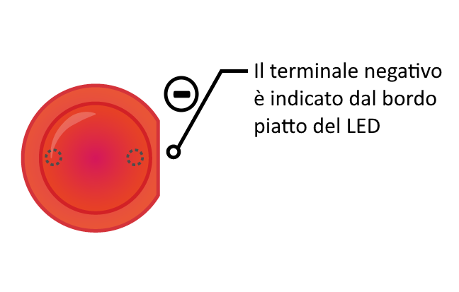

Per accendere un LED, è necessario creare un circuito con questi componenti:

| Breadboard                           | Cavi jumper maschio-femmina        | LED                    | Resistore                         | Alimentazione                          |
| ------------------------------------ | ---------------------------------- | ---------------------- | --------------------------------- | -------------------------------------- |
|  |  |  |  |  |

Dai un'occhiata al tuo LED. Dovresti vedere che un terminale è più lungo dell'altro. Il terminale lungo è il terminale **positivo**, chiamato anche **anodo**. Dovrebbe essere sempre collegato al lato positivo di un circuito. Il terminale corto è il terminale **negativo**, chiamato **catodo**. Deve essere collegato al lato negativo. Un modo per ricordarselo è immaginare che al terminale lungo sia stato aggiunto (+) qualcosa e al terminale corto sia stato sottratto (-) qualcosa.

Scoprirai che ci sono LED con terminali della stessa lunghezza. In questi casi, il terminale positivo è il terminale in cui il bordo di plastica del LED è rotondo. Dove si trova il terminale negativo, il bordo sarà appiattito, come nell'immagine qui sotto.

+ Inserisci il terminale positivo del LED nella riga 1 della breadboard, vicino al lato sinistro del solco centrale. Posiziona il terminale negativo nella riga 1 sull'altro lato del solco.

+ Ora trova il tuo resistore. Un resistore è un componente non polarizzato, quindi non importa in che direzione lo metti nella breadboard. Inserisci un terminale nella stessa fila in cui si trova il terminale negativo del LED così da farlo collegare al LED. Inserisci l'altro terminale del resistore in qualsiasi altra fila libera sul lato destro del solco.

+ Ora prendi un cavo jumper maschio-femmina e inserisci l'estremità maschio nella stessa fila del LED, sul lato sinistro del solco vicino al terminale positivo del LED. Inserisci l'estremità femmina sul pin GPIO **3V3**.

Il tuo circuito dovrebbe assomigliare a questo:

Ora collega i tuoi componenti al pin GPIO di terra (**GND**):

+ Assicurati che il tuo Raspberry Pi sia acceso. Prendi un altro cavo jumper maschio-femmina e inserisci l'estremità maschio nella stessa fila del secondo terminale del resistore, sullo stesso lato del solco. Quindi spingi l'estremità femmina sul pin **GND**. Il tuo LED dovrebbe accendersi!

Se il LED non si accende, prova quanto segue: 1) Verifica che il tuo Raspberry Pi sia acceso 2) Controlla che tutti i componenti siano inseriti saldamente nella breadboard 3) Controlla che il LED sia nella direzione corretta 4) Accertati che le gambe dei componenti si trovino sul lato destro del solco 5) Prova un altro LED
