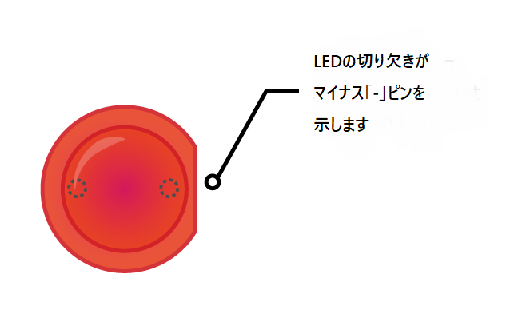

LEDを点灯するには、次の部品で回路を作る必要があります。

| ブレッドボード                           | オス-メス ジャンパー線                        | LED                    | 抵抗                         | 電源装置                                   |
| --------------------------------- | ----------------------------------- | ---------------------- | -------------------------- | -------------------------------------- |
|  |  |  |  |  |

LEDを見てください。 片方のピンがもう一方よりも長いことがわかるでしょう。 長いピンは**プラス**ピンで、**アノード**とも呼ばれます 。 このピンは回路のプラス側に接続します。 短いピンは**マイナス**ピンで、**カソード**と呼ばれます 。 こちらはマイナス側に接続します。 長いピンは何かがプラスされたもの、短いピンは何かをマイナスされたものと考えると覚えやすいでしょう。

ピンの長さが同じLEDもあります。 その場合、プラスピンはLEDのプラスチックのエッジが丸い側にあるピンです。 一方、マイナスピンは、下の図のように、エッジが平らな側にあります。

+ LEDのプラスピンをブレッドボードの切れ込みの左側すぐの1列目に差し込みます。 マイナスピンを切れ込みの反対側の1列目に差し込みます。

+ 次に、抵抗を使います。 抵抗は極性のない部品なので、ブレッドボードにどの向きで差し込んでもかまいません。 片方のピンLEDのマイナスピンと同じ並びの穴に差し込むと、LEDに接続されます。 抵抗のもう一方のピンを、切れ込みの右側で、使っていない別の列に差し込みます。

+ 次に、オス-メスジャンパー線を取り出し、オス側を切れ込みの左側のLEDのプラスピン近くでLEDと同じ並びの穴にを差し込みます。 メス側を**3V3** GPIOピンに差し込みます。

回路はこんな感じになります。

次に、グラウンド（** GND ** ）GPIOピンに接続しましょう：

+ Raspberry Piの電源が入っていることを確認してください。 別のオス-メスジャンパー線を取り出し、オス側を抵抗の2つ目のピンと同じ並びの、切り込みを隔てて抵抗と同じ側にある穴に差し込みます。 メス側を**GND** GPIOピンに差し込みます。 LEDが点灯するはずです。

LEDが点灯しない場合は、以下を試してください 1) Raspberry Piの電源が入っていることを確認します 2) すべての部品がブレッドボードにしっかりと差し込まれていることを確認します 3) LEDが正しい向きであることを確認します 4) 部品のピンが切り込みを隔てて正しい側にあることを確かめます 5) LEDを交換してみます
