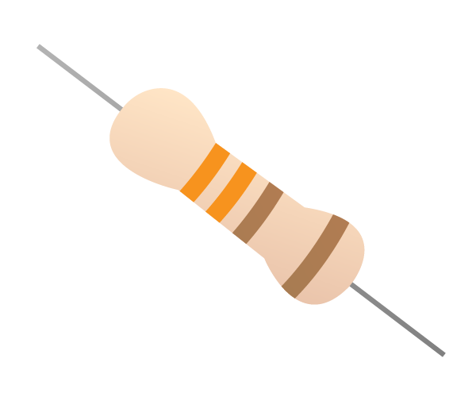

LED 불빛을 켜려면 다음 구성 요소로 회로를 만들어야 합니다:

| 브레드보드                           | M-F 점퍼 케이블                         | LED                    | 저항                         | 전원 공급 장치                                |
| ------------------------------- | ---------------------------------- | ---------------------- | -------------------------- | --------------------------------------- |
|  |  |  |  |  |

가지고 있는 LED를 살펴보세요. 아마 다리의 길이가 다를 것입니다. 긴 다리는 **+**극, 혹은 **양극**이라고 합니다. 이 다리는 항상 회로의 + 부분에 연결되어 있어야 합니다. 짧은 다리는 **-**극, 혹은 **음극**이라고 합니다. 이 다리는 회로의 - 부분에 연결되어야 합니다. 이것을 기억할 수 있는 한 가지 방법은, 긴 다리에는 무엇인가 더(+) 있고, 짧은 다리는 무엇인가 부족(-)하다는 식으로 생각하는 것입니다.

LED 중에서는 다리의 길이가 같은 것들도 있습니다. 그런 경우에는, +극이 LED 위 플라스틱의 가장자리가 둥근 부분입니다. -극이 있는 곳은 아래의 그림과 같이 가장자리가 평평할 것입니다.

+ 브레드보드의 움푹 파인 부분(이하 '골짜기'라고 지칭)의 왼쪽 편에서, LED의 +극을 1행에 꽂으세요. 다음 골짜기의 오른쪽에서 1행에 -극을 꽂으세요.

+ 이제 저항을 준비해주세요. 저항은 극성이 없는 부품으로, 브레드보드에서 꽂는 방향은 상관이 없습니다. LED와 연결이 되게끔, 저항의 한쪽 다리를 LED의 -극과 같은 행에 꽂아주세요. 저항의 다른쪽 다리는 골짜기 오른쪽에서 비어 있는 아무 행에 꽂아줍니다.

+ 이제 M-F 점퍼 케이블을 꺼낸 다음 점퍼선의 M단자(금속이 튀어나온 끝부분)를 골짜기 왼쪽편에서 LED의 +극과 같은 행에 연결합니다. 그리고 F단자(구멍이 있는 부분)를 **3V3** GPIO 핀에 연결합니다.

회로는 다음과 같아야 합니다.

이제 구성 요소를 그라운드(**GND**) GPIO 핀에 연결하세요:

+ Raspberry Pi의 전원이 켜져 있는지 확인하세요. 또 다른 M-F 점퍼 케이블을 가져와 저항의 두번째 다리와 같은 편, 같은 행에 M단자를 꽂습니다. 그리고 F단자를 **GND** GPIO 핀에 연결합니다. 이제 LED가 켜질 것입니다!

만약 LED가 켜지지 않는다면, 다음을 시도하세요: 1) Raspberry Pi가 켜져 있는지 확인하기 2) 모든 부품들이 브레드보드에 제대로 꽂혀 있는지 확인하기 3) LED의 극성 확인하기 4) 구성 부품들의 다리가 골짜기의 오른쪽에 있는지 확인하기 5) 다른 LED로 시도하기
