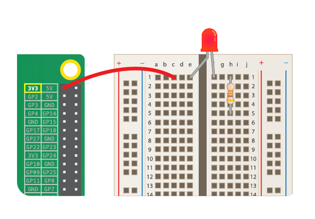

Aby zaświecić diodę LED, musisz zbudować obwód z tych elementów:

| Płytka stykowa                           | Przewód męsko-żeński                         | Dioda LED                    | Rezystor                         | Źródło zasilania                       |
| ---------------------------------------- | -------------------------------------------- | ---------------------------- | -------------------------------- | -------------------------------------- |
|  |  |  |  |  |

Spójrz na swoją diodę LED. Powinieneś zauważyć, że jedna nóżka jest dłuższa od drugiej. Długa nóżka jest **dodatnią**, jest także nazywana **anodą**. Ona zawsze powinna być podłączona do dodatniej strony obwodu. Krótka nóżka jest **ujemną**, nazywana jest **katodą**. Musi być podłączona do strony ujemnej. Jednym ze sposobów na zapamiętanie tego jest wyobrażenie sobie, że długa noga ma coś dodanego, a krótka noga jako coś zabranego.

Przekonasz się, że istnieją też diody LED, które mają nóżki tej samej długości. W takim przypadku dodatnia nóżka to ta, w której plastikowa krawędź diody LED jest okrągła. Tam, gdzie znajduje się nóżka ujemna, krawędź zostanie spłaszczona, jak na obrazku poniżej.

+ Wciśnij dodatnią nóżkę diody LED w 1 rzędzie płytki stykowej, blisko lewej strony rowka. Umieść nóżkę ujemną w rzędzie 1 po drugiej stronie rowku.

+ Teraz znajdź swój opornik. Rezystor jest komponentem niespolaryzowanym, więc nie ma znaczenia, w którą stronę umieścisz go na płytce. Wepchnij jedną nogę do tego samego rzędu, w którym znajduje się ujemna noga LED, aby łączyła się z diodą LED. Wepchnij drugą nogę opornika do dowolnego wolnego rzędu po prawej stronie rowku.

+ Teraz weź przewód połączeniowy męsko-żeński i wepchnij męski koniec do tego samego rzędu co dioda LED, po lewej stronie rowku w pobliżu dodatniej nogi LED. Wciśnij żeński koniec na pin **3V3** GPIO.

Twój obwód powinien wyglądać tak:

Teraz podłącz swoje komponenty do uziemienia pin (**GND**) GPIO:

+ Upewnij się, że twoje Raspberry Pi jest włączone. Weź kolejny przewód połączeniowy męsko-żeński i wepchnij męski koniec do tego samego rzędu co druga noga rezystora, po tej samej stronie wąwozu. Następnie wciśnij żeński koniec na swój pin **GND**. Twoja dioda LED powinna się zaświecić!

Jeśli dioda LED nie świeci, spróbuj wykonać następujące czynności: 1) Sprawdź, czy Raspberry Pi jest włączone 2) Sprawdź, czy wszystkie elementy są mocno wciśnięte w płytkę stykową 3) Sprawdź, czy dioda LED jest włożona prawidłowo 3) Upewnij się, że nóżki twoich elementów znajdują się po prawej stronie wąwozu 5) Wypróbuj inną diodę LED
