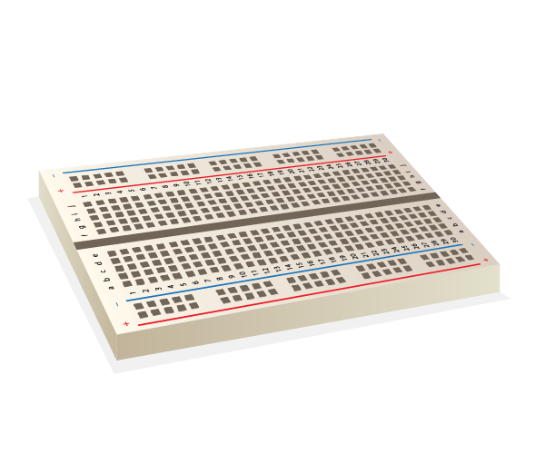

Para acender um LED, tu precisas de construir um circuito com estes componentes:

| Placa de ensaio                           | Fios de ligação macho-fêmea      | LED                    | Resistência                         | Componente de energia                  |
| ----------------------------------------- | -------------------------------- | ---------------------- | ----------------------------------- | -------------------------------------- |
|  |  |  |  |  |

Dá uma olhadela no teu LED. Deves de reparar que uma perna é mais longa que a outra. A perna longa é a perna **positiva**, e também chamada de **ânodo**. Deve sempre ser ligada ao lado positivo de um circuito. A perna curta é a perna **negativa**, chamada de  **cátodo**. Precisa de ser ligada ao lado negativo. Uma maneira de recordar isto é imaginar a perna longa como tendo algo acrescentado e a perna curta como tendo algo retirado.

Tu descobrirás que existem LEDs com pernas do mesmo comprimento. Nesse caso, a perna positiva é a perna em que a borda plástica do LED é redonda. Onde a perna negativa está, a borda será achatada, como na imagem em baixo.

+ Empurra a perna positiva do LED para a linha 1 da tua placa de ensaio, perto do lado esquerdo da ravina. Coloca a perna negativa na linha 1 do outro lado da ravina.

+ Agora encontra a tua resistência. A resistência é um componente não polarizado, portanto, não importa em que sentido tu a colocas na placa de ensaio. Empurra uma perna na mesma linha em que a perna negativa do LED está, para que ela se ligue ao LED. Empurre a outra perna da resistência para qualquer outra linha livre no lado direito da ravina.

+ Agora pega um fio de ligação macho-fêmea e empurra a extremidade macho na mesma linha do LED, no lado esquerdo da ravina, próximo à perna positiva do LED. Empurra a extremidade fêmea para o pino GPIO **3V3**.

O teu circuito deve ficar assim:

Agora, liga os teus componentes ao pino GPIO neutro (**GND**):

+ Garante que o teu Raspberry Pi está ligado. Agarra outro fio de ligação macho-fêmea e empurra a extremidade macho na mesma linha da segunda perna da resistência, no mesmo lado da ravina. De seguida, empurra a extremidade fêmea para o pino **GND**. O teu LED deverá acender!

Se o teu LED não acender, tenta o seguinte: 1) Verifica que o Raspberry Pi está ligado 2) Verifica se todos os teus componentes estão firmemente pressionados na placa ensaio 3) Verifica que o LED está na orientação certa 4) Verifica se as pernas dos teus componentes estão do lado correto da ravina 5) Tenta outro LED
