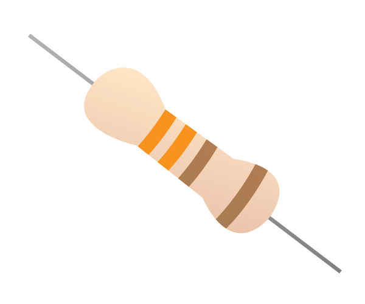

想要点亮一个 LED，你需要下面的元件组成一个电路

| 面包板                           | 公对母跳线                         | LED                    | 电阻                         | 电源                             |
| ----------------------------- | ----------------------------- | ---------------------- | -------------------------- | ------------------------------ |
|  |  |  |  |  |

看看你的 LED 你应该看到一条腿比另一条腿长。 长的一条是 **正极**，有时也被称为 **阳极**。 它应始终连接到电路的正极。 短的是 **负极**，有时也被称为**阴极** 。 它需要连接到电路的负极。 记住这一点的一种方法是，将长腿想象成有东西流进来，而短腿想象成有东西被流出去。

有时你会发现有些 LED 的支脚长度相同。 在这种情况下，正极是 LED 的塑料边缘为圆形的脚。 负极所在的一端，边缘缺一角，如下图所示。

+ 将 LED 的正极插入面包板的第一行，靠近沟槽的左侧。 把负极插入沟槽的另外一边的第一行。

+ 现在找出你的电阻。 电阻是无极性的组件，因此无所谓怎么样插入面包板。 将一只脚插入 LED 负极所在的同一行中，以便将其连接到LED。 将另一只脚插入沟槽右边的任何其他空行中。

+ 现在，使用一根公对母跳线，并将其突出的一边插入与 LED相同的行中，位于沟槽的左侧，靠近 LED 的正极。 将有插槽的一边插入 **3V ** GPIO引脚。

你的电路看起来应该像这样：

现在，将你的组件连接地线(**GND**) GPIO 引脚：

+ 确保你的树莓派已接通电源。 拿另一根公对母跳线，将突出的一端插入与电阻第二只脚在沟槽同一侧的同一行中。 将有插槽的一边插入 **GND** GPIO引脚。 你的 LED 应该亮啦！

如果你的 LED 灯不亮，请尝试以下操作： 1) 检查你的 树莓派 是否已打开 2) 检查你的所有组件均已牢固地插入面包板 3) 检查您的 LED 灯正负极是否正确 4) 确保元件的的腿插入正确的沟槽两侧 5) 换另一个 LED 试试
