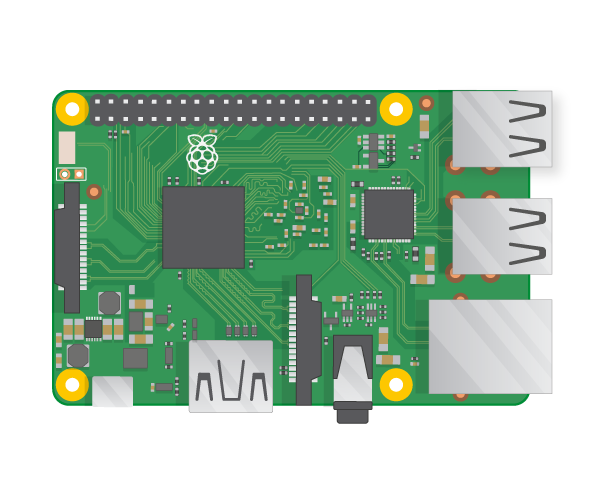

要點亮LED，您需要使用以下零件來構建電路：

| 麵包板                           | 公對母跳線                         | LED                    | 電阻器                         | 電源組件                                   |
| ----------------------------- | ----------------------------- | ---------------------- | --------------------------- | -------------------------------------- |
|  |  |  |  |  |

看看您的LED。 您應該會看到一邊比較長的腳 長腳是**正極**，也稱為**陽極** 。 它應始終連接到電路的正極。 短腳是**負極**，也稱為**陰極** 。 它需要連接到負極。 一種記住的方法是，將長腳想成有東西被加上，而短腳想成有東西被移除。

您會發現有些LED的支腳長度相同。 在這種情況下，LED的塑料邊緣為圓形的是正極。 而邊緣為平的是負極，如下圖所示。

+ 將LED的正極腳推入麵包板的第1行，靠近沟壑的左側。 將負極放在沟壑另一側的第1行中。

+ 現在找到您的電阻。 電阻器是無極性的組件，因此不論哪個方向放入麵包板中都沒有關係。 將一隻腳推入LED負極腳所在的同一行中，以便將其連接到LED。 將另一個電阻腳推入沟壑右側的任何其他任一行中。

+ 現在，使用一根公對母跳線，並將其一端推入與LED相同的行中，位於沟壑的左側，靠近LED的正極。 將母端推入** 3V3 ** GPIO引腳。

您的電路看起來應該像這樣：

現在，將您的組件接地（** GND ** ）GPIO引腳：

+ 確保您的Raspberry Pi已打開電源。 拿另一根公對母跳線，將公端與電阻器第二條支腳在沟壑的同一側推入同一行。 然後將母端推入您的** GND **針位。 您的LED應該會亮起！

如果您的LED指示燈不亮，請嘗試以下操作： 1）檢查您的Raspberry Pi是否已打開 2）檢查您的所有組件均已牢固地推入麵包板 3）檢查您的LED指示燈是否正確 4）確保組件的腿位於沟壑的右側 5）嘗試另一個LED
